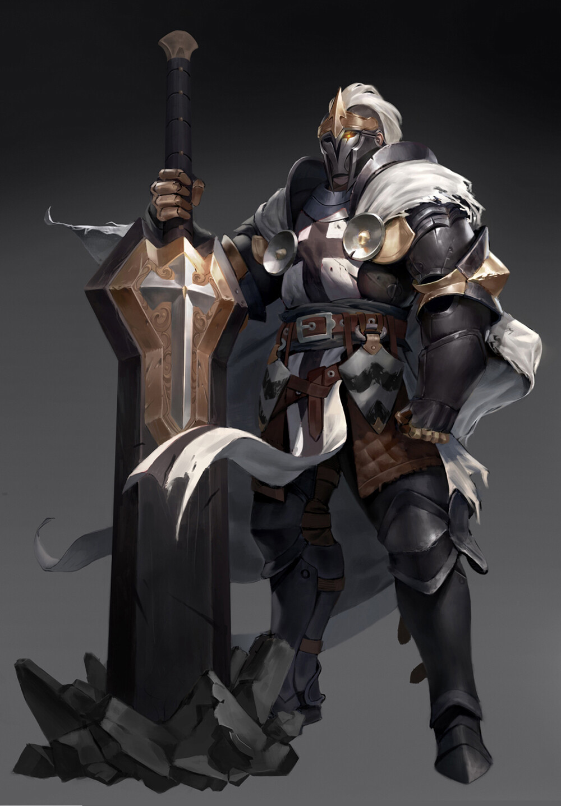

# Welcome to the Order

This repo is where I will store write-ups for practice machines for CTF, any public write-ups I am allowed to share, and any projects I am working on for practicing defense or offense

## Sword and Board

This section will be any projects I may work on that involve both offense and defense, something that shows skills in purple team type skills and exercises

## Press the Offensive! (Smite)

I will store anything here that is related to offensive security - this includes CTF write-ups, classwork write-ups (for things like studying for PNPT), any public pentests I'm allowed to share.

## Stop the Advance! (Shield of Faith)

This section will be projects relating solely to defensive measures, such as hardening efforts, SIEM practice, and other things of this nature.

For my first planned project in this section there will be overlap with purple team/red type skills, such as vulnerability assessments. For this project I will put the offensive skills in purple team and make sure to use links between the 2
to keep the flow.
